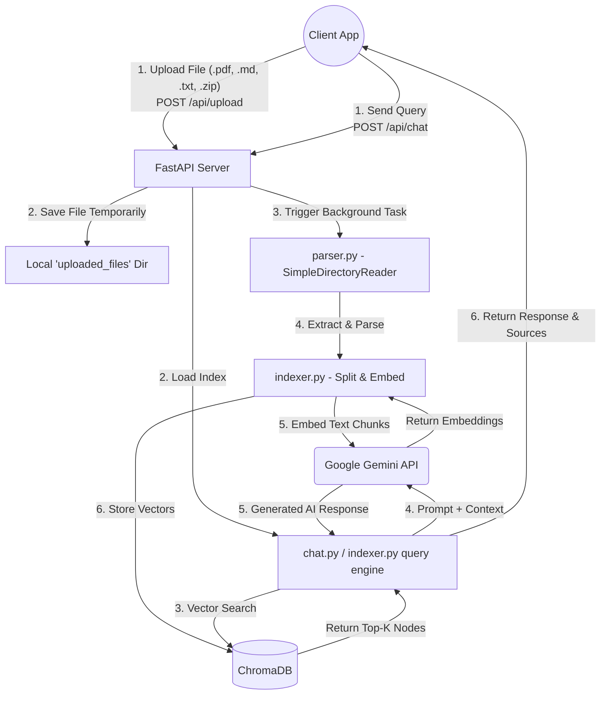

# AI Developer Knowledge Assistant - Architecture Flow

This document outlines the high-level architecture of the AI Developer Knowledge Assistant project and explains the two primary operational flows step-by-step.

## Full System Architecture Diagram

---

## Flow 1: Document Ingestion and Indexing Flow

This flow covers how the system receives documents from the user, processes them, and stores their knowledge into the vector database.

1. **Client Upload**: The user uploads a valid file (PDF, TXT, MD, or ZIP) through the client application to the backend's `/api/upload` endpoint. Fast API validates the file size and extension.
2. **Temporary Storage**: The backend saves the raw file to a local directory named `uploaded_files`.
3. **Background Processing**: To avoid blocking the web request, a background task (`parse_and_index`) is appended, allowing the server to immediately return a "Processing" status to the client.
4. **Document Parsing**: In the background, `app.services.parser.py` kicks in. It uses LlamaIndex's `SimpleDirectoryReader` to extract and read the content of the file. If it's a ZIP file, it automatically unzips it into a safe directory and parses all nested files.
5. **Text Splitting & Embedding**: The textual content is routed to `app.services.indexer.py`. The text is broken down into smaller, manageable chunks (512 tokens) using `SentenceSplitter`. Then, it makes a request to the Google GenAI API (`models/gemini-embedding-001`) in small batches to generate semantic vector embeddings for each text chunk.
6. **Vector Storage**: Finally, those generated vector embeddings are permanently inserted to the local ChromaDB database (saved in `./chroma_db`). The file status is marked as 'completed'.

---

## Flow 2: Query Retrieval and Generation Flow (RAG)

This flow explains what happens when a user asks the AI a question, utilizing the retrieved documents to provide contextual answers.

1. **User Query**: The user types a question in the client chat interface and submits it. The application sends this as a POST request to the `/api/chat/` endpoint.
2. **Index Loading**: The backend verifies the Google API key and immediately prepares the vector knowledge base by connecting to the local ChromaDB persistent instance in `indexer.py`.
3. **Similarity Search (Retrieval)**: A query engine is constructed for the vector store. The backend runs a similarity search against the ChromaDB, returning the top 3 (`similarity_top_k=3`) most relevant text chunks (nodes) relative to the user's question.
4. **LLM Generation (Augmented Generation)**: The retrieved context is bundled alongside the user's original query. This augmented prompt is sent to the Google Gemini model (e.g., `gemini-2.0-flash`). Built-in retry mechanisms and rate-limit backoffs ensure the system recovers gracefully from transient API limits.
5. **Response Delivery**: The Gemini API generates the correct semantic answer. The backend then formats this AI response alongside the exact sources where it pulled the context from (mapping file names to generated text) and returns everything to the client interface for display.
