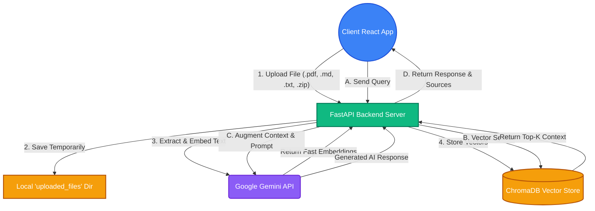
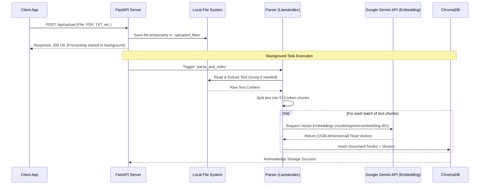
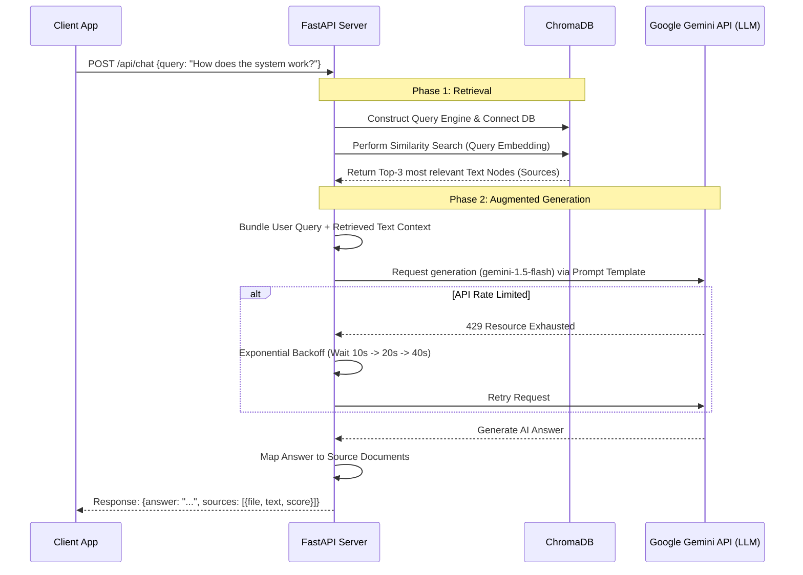

# AI Developer Knowledge Assistant - Architecture Flow

This document details the complete high-level system architecture of the project and provides in-depth, step-by-step explanations of the two primary operational flows: **Document Ingestion** and **Query Generation (RAG)**.

---

## 🏗️ 1. Full System Architecture Diagram

This high-level diagram visualizes the primary components of the system and how they interact during both document upload and user querying.

---

## 📥 Flow 1: Document Ingestion and Indexing Flow

This flow explains the step-by-step process of how the system processes a user's uploaded document, extracts its knowledge, and permanently stores it into the vector database.

### Ingestion Sequence Diagram

### Step-by-Step Explanation

1. **Client Upload (`POST /api/upload`)**:
   The user selects a file (PDF, TXT, MD, or ZIP) from the React Client Application. The file is sent over an HTTP POST request to the backend server. The FastAPI backend validats the file type and ensures it meets basic size requirements.
2. **Temporary Local Storage**:
   The server immediately saves the raw uploaded file into a local directory (`./uploaded_files`). This acts as an intermediary staging ground.
3. **Background Task Initiation**:
   To provide a snappy user experience, the server immediately returns a `200 OK` "Processing" status to the React interface, while kicking off the heavily computational `parse_and_index` process as an asynchronous background task.
4. **Document Extraction & Parsing**:
   The background task uses `LlamaIndex`'s `SimpleDirectoryReader` (`parser.py`). It scrapes all readable text from the file. If an uploaded document is a `.zip` archive, it automatically unzips it into a safe directory and iterates over all nested supported files.

5. **Text Splitting & Embedding Chunking**:
   The extracted text cannot be ingested all at once. In `indexer.py`, the massive text block is broken down into smaller, meaning-dense chunks (typically ~512 tokens) using a `SentenceSplitter`.
6. **Vector Generation via Google API**:
   The backend makes a network request to the `Google Gemini API` (`gemini-embedding-001`) passing the array of text chunks. Google's cloud turns these textual strings into semantic vector embeddings (large arrays of float numbers capturing the contextual meaning).
7. **Permanent Vector Storage**:
   Finally, these newly generated vectors are persisted into the local `ChromaDB` directory alongside the original document metadata (like file name and file IDs). The file is now fully "memorized" by the system.

---

## 💬 Flow 2: Query Retrieval and Generation Flow (RAG)

This flow maps exactly what happens under the hood when a user asks a question, demonstrating how the system fetches relevant information to deliver an AI-generated, hallucination-free answer.

### Query Retrieval Sequence Diagram

### Step-by-Step Explanation

1. **User Query (`POST /api/chat`)**:
   The user types a natural language question into the React chat interface. The client wraps this payload and sends it to the backend `chat_query` endpoint.

2. **Index Loading & DB Connection**:
   The backend executes `get_or_create_index()` to guarantee the vector knowledge base is loaded into memory, securely connecting to the persistent `ChromaDB` instance on disk.

3. **Semantic Similarity Search (The Retrieval phase)**:
   The backend transforms the user's question into its own vector embedding using the same Google embedding model. It then runs a mathematical similarity search inside ChromaDB comparing the question vector against the entire stored database. It retrieves the top 3 (`similarity_top_k=3`) closest matching text chunks.
4. **Context Augmentation Phase**:
   Rather than asking the LLM immediately, the backend builds a "Prompt Template". It intercepts the 3 returned text snippets and bundles them alongside the user's original question into one massive, context-aware prompt.

5. **LLM Generation via Google Gemini**:
   This mega-prompt is sent to the Google Gemini model. Should a rate-limit be encountered (e.g., HTTP `429`), the backend automatically pauses and applies an exponential back-off strategy (retrying after 10s, 20s) to guarantee the request eventually succeeds.
6. **Response Delivery with Citations**:
   The Gemini API computes and returns a semantically correct answer based _exclusively_ on the provided context. The FastAPI backend maps the result back to the specific metadata (document names, relevance scores) and sends the complete JSON package back to the client interface for rendering.
